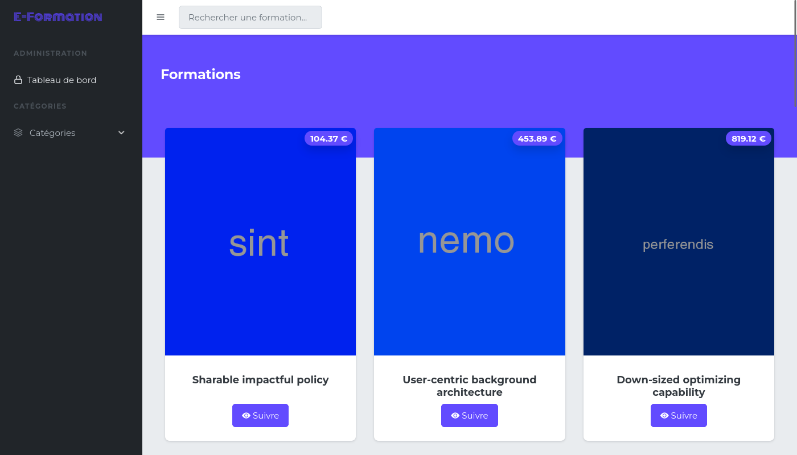
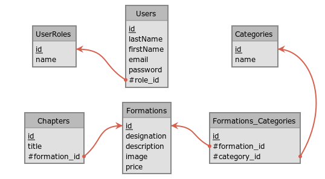

# E-Formation

## Contexte

E-Formation est une plateforme de E-learning gérée par un administeur des
formateurs et ouverts au clients

Les clients peuvent voir les formations et les consulter

Les formateurs gèrent leur formation (ajout, suppression, création, demande de compte)

Les administrateurs eux gèrent toute la plateforme, ils ont les mêmes droits que
les utilisateurs, et formateurs, mais peuvent confirmer l'ajout ou non des
utilisateurs  

Démo en ligne : [http://e-formations.herokuapp.com/formations](http://e-formations.herokuapp.com/formations)

## Installation du projet

-   Il est nécessaire d'avoir composer installé

-   Dupliquer le fichier .env.example en le rennommant en .env.example puis
    configurer la base de donnée grâce aux variables et le serveur de mail:

        DB_CONNECTION=db_connection
        DB_HOST=db_host
        DB_PORT=db_port
        DB_DATABASE=db_name
        DB_USERNAME=db_username
        DB_PASSWORD=db_password

        MAIL_MAILER=smtp
        MAIL_HOST=mail_server_host
        MAIL_PORT=mail_server_port
        MAIL_USERNAME=mail_server_username
        MAIL_PASSWORD=mail_server_password
        MAIL_ENCRYPTION=mail_server_encryption

-   Taper les commandes suivantes à la racine du projet:

        .../e-formation > composer install

        .../e-formation > php artisan migrate:fresh --seed

## Lancement du projet

-   Taper la commande suivante:
    
        .../e-formation > php artisan serve

## Se connecter en tant qu'administrateurs

*email:* admin@admin.com

*mot de passe:* admin

## MCD

